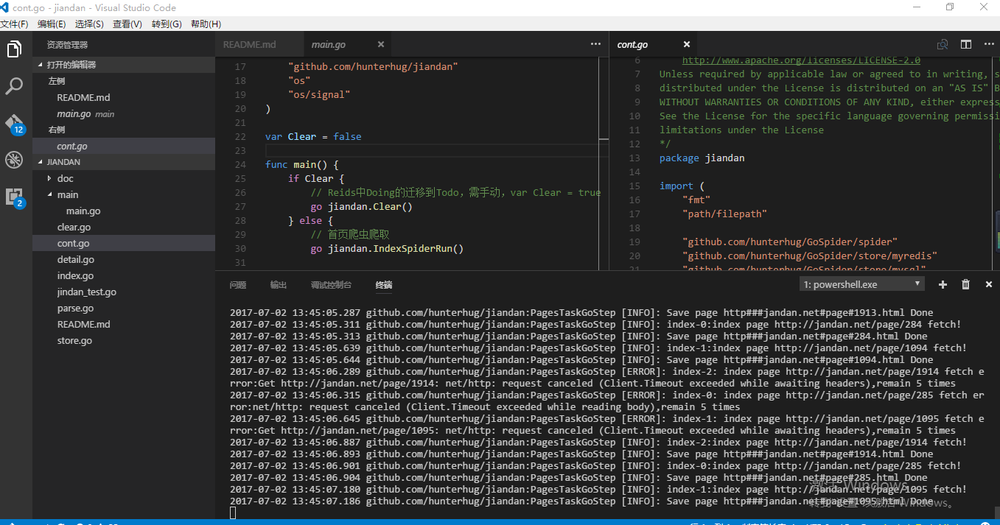

# 煎蛋分布式文章爬虫

## 萌萌介绍

多浏览器持久化cookie分布式爬虫爬取数据,使用到redis,mysql,将网页数据保存在磁盘中,详情页解析后存入数据库。

爬虫工程师进阶必备!高级示例！依赖核心库：[土拔鼠Golang爬虫包](https://github.com/hunterhug/GoSpider)

环境安装请查看：[个人博客](http://www.lenggirl.com/tool/gospider-env.html)

本项目使用docker方式：[https://github.com/hunterhug/GoSpider-docker](https://github.com/hunterhug/GoSpider-docker)

结果,总共抓取了58,097 篇文章, 可在多台机器同时开启爬虫,分布式抓取。

## 如何使用

获取代码：

```
go get -u -v github.com/hunterhug/jiandan
```

1.编辑`config.json`配置,说明如下：

```
{
  "dir": "",  // 原始html文件保存路径,留空为二进制执行所在目录
  "log": "info",  // 日志级别,改为debug可看到cookie等
  "detail_spider_num": 30, // 详情页爬虫并发数
  "index_spider_num": 3, // 列表页爬虫并发数
  "time_out": 15,  // html获取超时时间
  "redis": {   // redis设置
    "Host": "127.0.0.1:6379",
    "Password": "GoSpider", // 密码为空留空,本项目docker环境密码为GoSpider
    "DB": 0
  },
  "mysql": {  // mysql配置
    "Username": "root",  //用户名
    "Password": "459527502", // 密码,本项目docker环境密码为459527502
    "Ip": "127.0.0.1",
    "Port": "3307", // 端口,本项目为了防止和自己的mysql冲突,改为3307,见help/docker-compose.yaml
    "Dbname": "jiandan"
  }
}

```

2.运行程序

先安装`mysql`和`redis`,为了省事,你可以这样[Linux用户](help/README.md),Window用户请自行安装:

```
cd help
./build
```

然后

```
go run main.go
```

或者

```
./install.sh 
# 之后执行相应的二进制
# Window用户这样:jiandan_windows_amd64.exe 
./jiandan_linux_amd64
```



3.数据保存在data文件夹和数据库中,重抓要删除Redis(如何删除请百度)数据库和文件夹(全部)

如果只是接力,即是增量抓取,那么不需要删redis并且文件夹`data/detail`可不删,其他文件(重点)要删。


4.其他

可传入参数如下:
```
  -clear
        Reids中Doing的迁移到Todo(默认false)
  -config string
        配置文件位置(默认当前位置下config.json) (default "/home/jinhan/code/src/github.com/hunterhug/jiandan/config.json")

```

如:

```
go run main.go -config=/home/config.json -clear=1
```

详细说明见[http://www.lenggirl.com/spider/jiandan.html](http://www.lenggirl.com/spider/jiandan.html),代码改了一部分了..

## 支持大兄弟

如果你觉得项目帮助到你,欢迎请我喝杯咖啡

微信


支付宝


欢迎加入 [爬虫群](https://segmentfault.com/g/1570000010693834)

# License

```
/*
Copyright 2017 by GoSpider author.
Licensed under the Apache License, Version 2.0 (the "License");
you may not use this file except in compliance with the License.
You may obtain a copy of the License at
    http://www.apache.org/licenses/LICENSE-2.0
Unless required by applicable law or agreed to in writing, software
distributed under the License is distributed on an "AS IS" BASIS,
WITHOUT WARRANTIES OR CONDITIONS OF ANY KIND, either express or implied.
See the License for the specific language governing permissions and
limitations under the License
*/
```